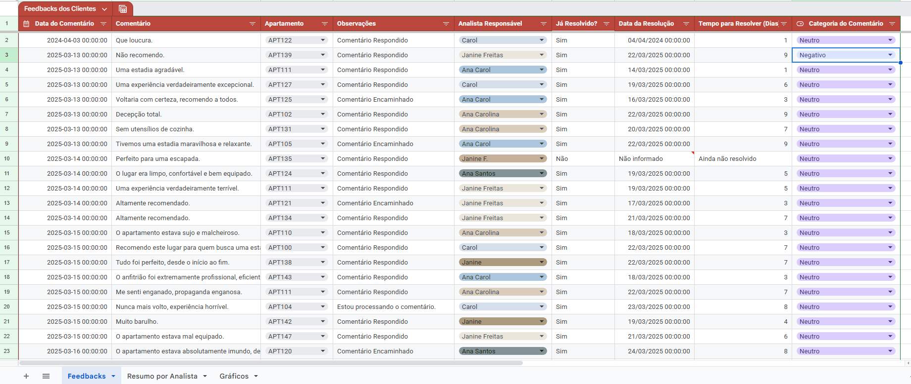
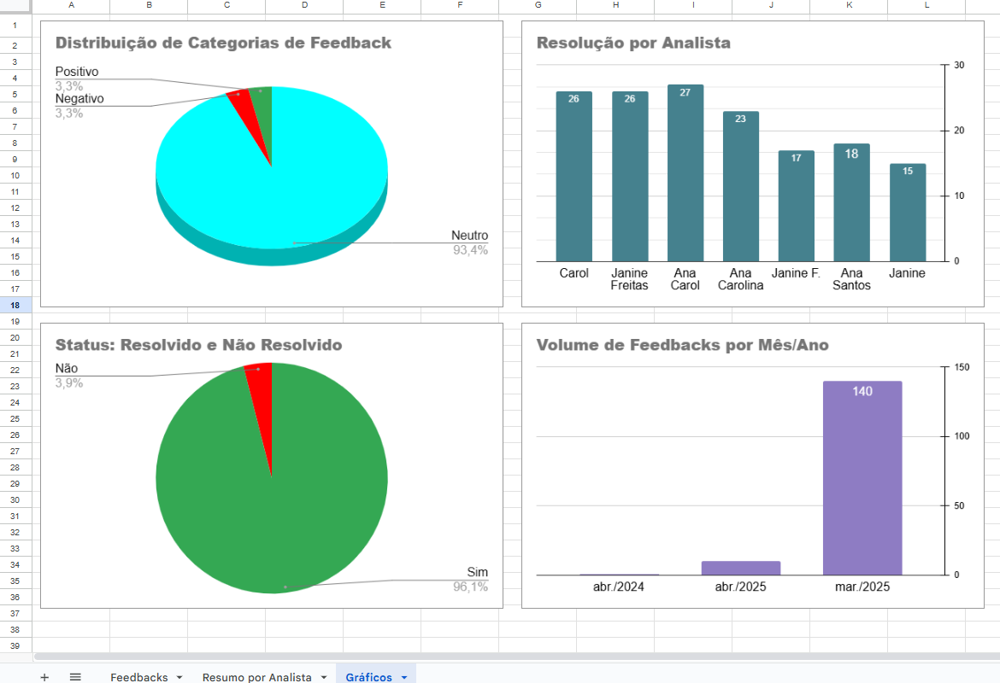

# 📊 Análise de Feedbacks de Clientes

Este projeto automatiza o processo de coleta, tratamento e visualização de feedbacks de clientes com o objetivo de apoiar decisões em áreas de Customer Success e Operações. Os dados são extraídos de uma API pública, organizados com Python e exibidos visualmente no Google Sheets por meio de dashboards simples e funcionais.

## Funcionalidades:

- Consumo de dados via API pública (JSON).
- Processamento e limpeza dos dados com Python.
- Cálculo de indicadores como tempo médio de resposta, total de feedbacks por analista, status de retorno, entre outros.
- Exportação dos dados tratados para uma aba específica do Google Sheets (`Feedbacks`).
- Geração de gráficos automáticos na aba `Resumo`, com base em intervalos nomeados.
- Estrutura pronta para integração com agendamentos e alertas.

## Tecnologias utilizadas:

- Python 3
- Bibliotecas: `requests`, `gspread`, `pandas`, `oauth2client`
- Google Sheets API

## 🔐 Autenticação

Este projeto requer credenciais do Google para acessar a API do Google Sheets.

Crie um arquivo chamado `credenciais-google.json` com suas credenciais e salve na raiz do projeto.

Você pode gerar esse arquivo seguindo o guia oficial da [Google Cloud](https://cloud.google.com/docs/authentication/getting-started).

> **Nota:** O arquivo `credenciais-google.json` está incluído no `.gitignore` e não é enviado ao GitHub, garantindo a segurança das informações sensíveis.

## Organização dos dados no Google Sheets:

- **Aba `Feedbacks`**: contém os dados tratados e atualizados via script Python.
- **Aba `Resumo por Analista`**: exibe indicadores de tempo médio de resposta (em dias) para cada analista. 
Essa aba permite identificar gargalos ou destaques individuais na operação, auxiliando a equipe de CS ou Operações a tomar decisões mais estratégicas.
- **Aba `Gráficos`**: contém gráficos automáticos com os principais indicadores do projeto.

### Exemplos visuais:





## ▶ Como executar:

1. Clone o repositório:  
```bash
git clone https://github.com/brunadgarcia/analise-feedbacks-clientes.git
cd analise-feedbacks-clientes
```
2. Instale as dependências:
```bash
pip install -r requirements.txt
```
3. Coloque seu arquivo `credenciais-google.json` na raiz do projeto.

4. Execute o script principal:
```bash
python main.py
```
